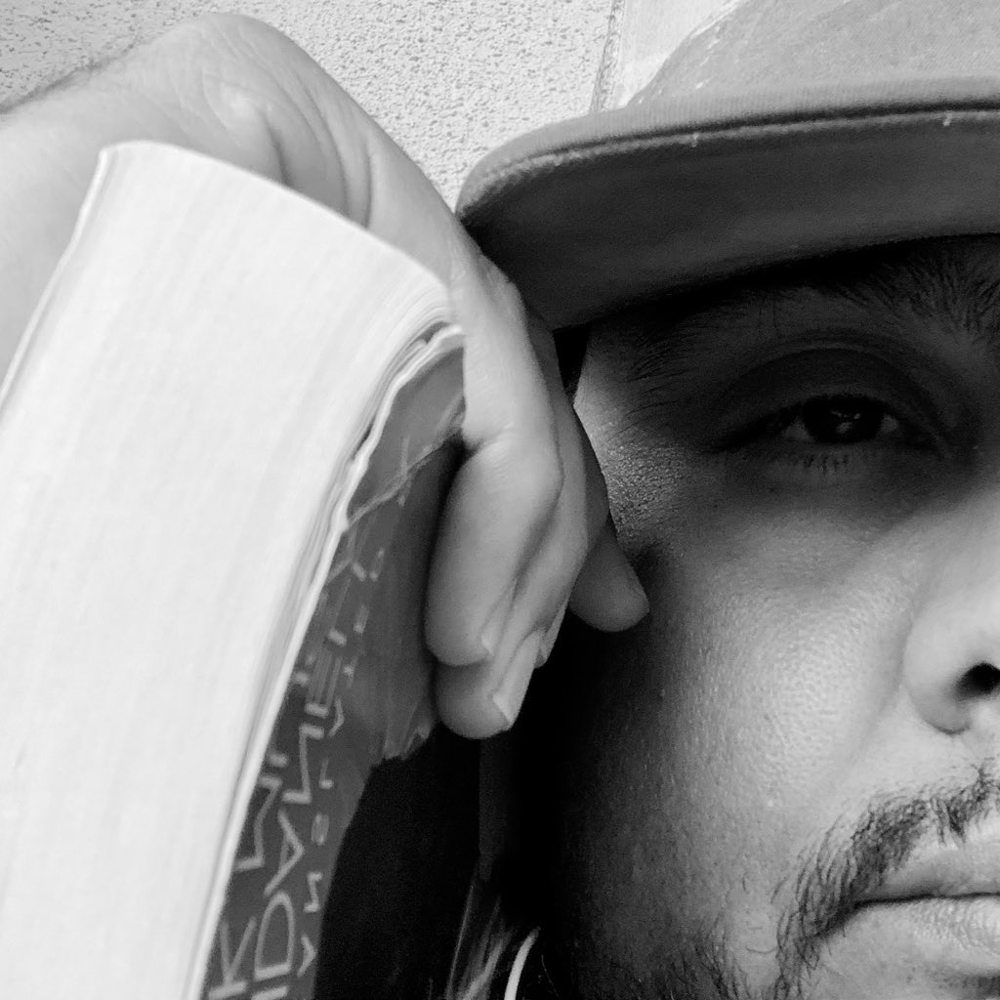

# About Josh

## Hello. My name is Josh.
I've been reading since before pre-school and have been actively writing since Kindergarten. I turned 40 in August, and you may expect that, by now, I have a fancy writing job or have published books. That's not quite the case. My web domain is WriterJoshua.com but, to simply label myself as a writer would be insufficient. 

While I have been fascinated with the English language from an early age, it is more accurate to call myself a student of life. There is not much about this life that I would not eagerly seek to understand more about.

What's great about writing, though, is that it is a limitless universe. All of the various activities I have, and will, explore can be written about. Not to mention, the also unlimited world of fiction and fantasy. You might be reading this and thinking "how blessed one must be" to have so much to draw from. Sure, I like to see it that way but, it comes with its challenges.By not comitting my entire self to any one particular discipline, it becomes easy for anyone to write me off as a visitor in their field. Because I love baseball so deeply, how could I be dedicated to music? If love to cook so much, why don't I become a Chef? I surely couldn't master a skill if I don't choose one to hyperfocus on for the rest of my life, could I? As a kid, I just wanted everyone ot get along, and sometimes that meant watering myself down and going with the flow. Sometimes, these questions were coming from myself.

We've all heard the 10,000 hours trope. While I do believe that practice is probably the best way to improve one's skill, I have also been blessed with an ability to understand things in a certain way. 

So, now, I think I'll write about them.

## Keratoconus
One major aspect affecting my life, therefore how and what I write about, is the degenerative eye disease, keratoconus. I am legally blind. If you only knew what I've had to go through to get these glasses. Technically, I can see well enough to write but, I owe more of that to my QWERTY muscle memory, Apple Accessibility Functions, and sheer determination. If you met me, you might not even know it unless we discussed it, or I had to read some fine print.

Although I'm legally blind, I'm blessed to be able to correct my vision significantly enough that participating in the world is somewhat possible. I can read a book, surf the web, watch movies, and even do photography. However, in order to do any of that, I must first rely on something outside of myself. For many years, that meant contact lenses. As my condition progressed, I was prescribed hard contacts and over time they began to do more damage than good. I was constantly in pain and if I didn't want to be, I would have to choose poor vision over comfort and relief.

Every day became a struggle. Before I qualified for disability, the first thing I had to do every morning was shove pieces of plastic into my already irritated eyes. On the odd day off, I could choose not to wear contacts but, that meant I couldn't drive a car, or use a computer, or even go for walk. If I didn't take the occasional "naked eye" day, the irritation would build I could end up with an infection. As my condition progressed, it meant that my eyes could no longer benefit from glasses of any shape or size. It was either sharp pain and be a productive member of society, or lay in bed all day listening to music.

After an unfortunate breakage, insurance coverage woes, and mounting eye pressure, I spent most of two years without any vision correction, at all, before participating in a few medical trials with uncomfortable lense varieties. Persistence has always been a strong suit of mine, though. While I never did get to drive a car again, I did figure out how to do many of the things I loved without the benefit of sight. Very carefully, I began to cook. Very slowly, I began to take long walks, even jogging on familiar terrain. Believe it or not, I even played a little soccer. I actually found a sense of freedom without wearing lenses. I took up photography, started making music, and even studied social media and marketing. 

While I do appreciate the benefit of disability insurance, and not having to go to work every day, I wish I didn't need it. I enjoyed getting some rest but, I'm just not a lazy person. I can veg out for a day or two, or relax on a vacation like anyone else but, I need to be doing something productive. Not to mention, without a paycheck my financial status leaves a lot to be desired. I remember thinking to myself quite often, how happy I would be to find something that I could do without the need for lenses.

I used to work in the kitchen but, without lenses, it wouldn't be safe for anyone. I can play sports but, baseball seems a little scary without eyes. I'm a decent writer but, how long would it take me to proofread everything without proper vision? Not to mention, how could I get to one of these jobs without being able to drive? (I know, I know. Public transportation is an option but, where I live, it's not very reliable. That's another discussion.) Also, who would take a chance on hiring me anyway, when there are plenty of other applicants who can see? However, there's a decent amount of good news. 

In 2022, I had a corneal transplant in one eye. It didn't fix my vision outright but, it made it possible to wear glasses again. Which is sort of a game changer as, my eyes were taking quite the beating from the last set of contact lenses I was wearing. I'm still searching for someone to do the other eye. Until then, I'm still significantly legally blind.

## The Drive
However, I don't allow any of these challenges to define me. As I write this, you are likely to be reading it from a webpage that I built from scratch. Of all the skills I've acquired, coding is just not at the top of my list but, with the help of AI, that gap closes every day. My love of language and literacy, couples well with my QWERTY keyboard training from a decade ago. Marry that with this insatiable hunger to learn, every day, and my story is only beginning.

As of February 2026, I've committed to hosting my work independently, thanks to GitHub and a few AI tools. While being able to see clearly enough to work on it, balancing stress and discomfort with visual clarity and mechanics, I intend to continue my creative, and investigative endeavors, sharing progress along the way.

*I will entertain proposals from like-minded individuals, intent on building excellence in any field you feel inspired to consult me with. If email isn't enough, you will find my socials on the Contact page, listed below.*

Joshua Lucero  
*[connect@writerjoshua.com](mailto:connect@writerjoshua.com)* 
---

### Also Read:
- [WriterJoshua Blog Archive](index.html?page=archive)
- [WriterJoshua Project List](index.html?page=projects)
- [Contact Joshua Lucero](index.html?page=contact)

### Donations
- [$WriterJoshua on Cash App][cashapp]
- [@WriterJoshua on Venmo][venmo]
- [@WriterJoshua on PayPal][paypal]

[cashapp]: https://cash.app/$writerjoshua
[venmo]: https://venmo.com/u/WriterJoshua
[paypal]: https://paypal.me/writerjoshua